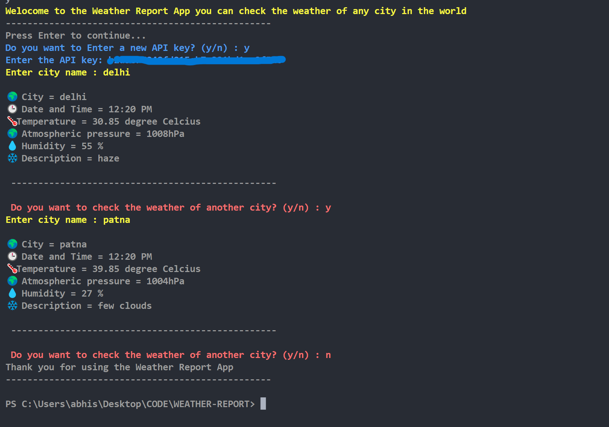

# WETHER-REPORT

## INTRODUCTION

You can view the weather report of any city by using this CLI app which lets you to view the

1. Time
2. Temperature
3. Atmospheric Pressure
4. Humidity
5. Description of the weather of that city .


## HOW TO USE ?

Clone the repo by using Git Clone 

```python-repl
git clone https://github.com/abhishek-kuma/WEATHER-REPORT.git
```

Run the weather.py by using the command

```python-repl
python weather.py
```

Generate the API key from Openweather Map and enter It .

Website to generate API KEY :

https://openweathermap.org/api


